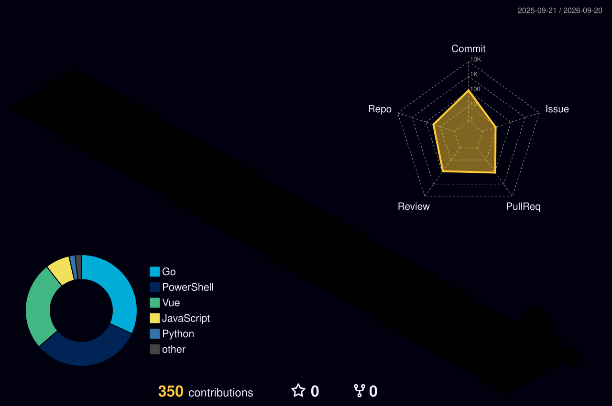

**俞可 · YU KE** — 全栈工程师，把业务从界面、接口、数据到 AI 链路和上线运维端到端做成可运行的系统  
Full-stack engineer. Interfaces, APIs, data, AI pipelines and production operations — delivered end to end.

  

  

  
  
  
  
  
  
  
  

  

  

  <picture>
    <source media="(prefers-color-scheme: dark)" srcset="https://raw.githubusercontent.com/kilisamemarisaaa/kilisamemarisaaa/output/github-contribution-grid-snake-dark.svg" />
    <source media="(prefers-color-scheme: light)" srcset="https://raw.githubusercontent.com/kilisamemarisaaa/kilisamemarisaaa/output/github-contribution-grid-snake.svg" />
    
  </picture>

  

  

